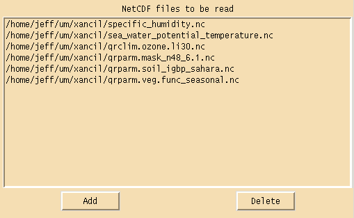
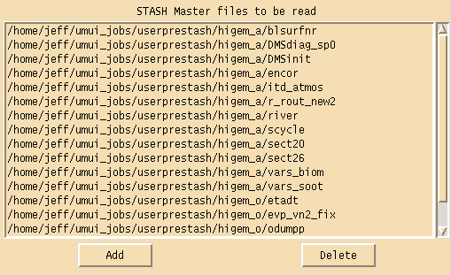
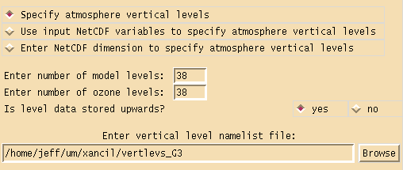
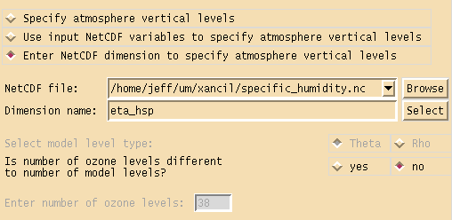
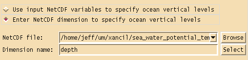
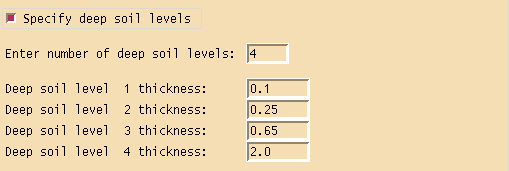
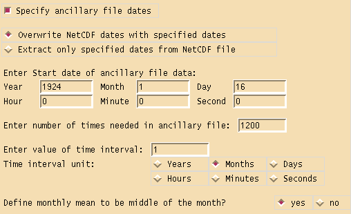
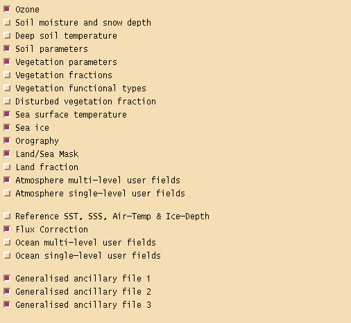

.. _config:

Configuration panels
====================

There are three configuration panels, the first one is for specifying the type and output format of the ancillary files along with reading in the netCDF input files and any user STASHmaster files needed.

The version number specified is used in the ancillary file headers and also determines what sort of vertical levels are used. For version numbers less than 5.0 the vertical coordinate type is hybrid sigma pressure, otherwise the vertical coordinate type is hybrid height. The calendar type can be either Gregorian or 360 day years. Ancillary files can written out in either 32 bit or 64 bit IEEE format, with 64 bit files having the option of packing the data as 32 bit values. Packing the data will make the file almost 50% smaller but will also lose floating point accuracy. Ancillary files can also be written in either big or little endian format. The size and endianness of the data needs to be chosen to match what the UM expects, on HECToR and at the Met Office this is 64 bit big endian data. HECToR uses byte swapping code to read/write big endian data as its native format is little endian. Well formed ancillary files have their data records written out in multiples of the given sector size, this can have performance advantages on certain machines and also makes the files slightly larger. The Xancil default is to output well formed ancillary files with a sector size of 2048, this what the Met Office use. There is little advantage playing around with this parameter, either use the default or switch it off. Warning later versions of the UM won't work unless the ancillary file is well-formed.

.. image:: images/xancil_0.50_general_config1.png
   :alt: General configuration panel - settings

NetCDF files can be pre-loaded in this section of the configuration panel, this allows the user to select the input netCDF file via a drop down menu when using the ancillary file creation panels.

Any user STASHmaster files needed in the creation of ancillary files can be loaded in this section of the configuration panel. These files add to or override any values found in the default STASHmaster files which are built into Xancil. STASHmaster files are used when creating user and generalised ancillary files and tell Xancil what the name of the ancillary field is, what the STASH and PP codes are, what the level type is, what the data type is and finally what part of the field, if any, is to be masked. All this information, except the field name, can be over-ridden by the user if necessary.

The second configuration panel is for defining the vertical grid structure of the ancillary files and supplying a global time definition.

If the following atmosphere ancillary files are being created, ozone, multi-level user ancillaries or generalised ancillaries with multi-level data, then the atmosphere vertical levels need to be defined. There are three options available to define these levels. Using the first option vertical levels can be defined via a namelist file, entering the number of model levels and the number of ozone levels and specifying whether the input data stored in the netCDF files is ordered from the bottom of the atmosphere upwards or from the top of the atmosphere downwards. 

The format of the vertical namelist file differs depending on whether the model version is using hybrid sigma pressure coordinates or hybrid height coordinates. In the first case the namelist group name is ``VERTICAL`` and can be extracted from the RECONA file generated by the UMUI for the job in which the ancillary files created are to be used. Note reconfiguration must be turned on in the UMUI to create a RECONA file. For example a vertical namelist file for a 19 level HadAM3 run would look like this 

::

 &VERTICAL
 METH_LEV_CALC= 5,
 ETAH= 1.000000000000,0.994000000000,0.956000000000,
 0.905000000000,0.835000000000,0.750000000000,0.650000000000,0.550000000000,
 0.460000000000,0.385000000000,0.325000000000,0.275000000000,0.225000000000,
 0.175000000000,0.125000000000,0.075000000000,0.040000000000,0.020000000000,
 0.010000000000,0.000500000000,  
 MIN_PRS_HLEV= 17, MAX_SIG_HLEV= 5,
 &END 

For the second case of hybrid height coordinates the namelist group name is ``VERTLEVS`` and the namelist file needed is the same as that used in the UM run for which the ancillary files are being generated. The location of this file is referenced in the UMUI output file INITHIS under the variable name ``VERT_LEV``. If Xancil is being run on a different machine to that which is running the UM, then the namelist file will need to be copied over. For example a vertical namelist file for a 38 level HadGAM run would look like this ::

 &VERTLEVS
  Z_TOP_OF_MODEL= 39254.833576,
  FIRST_CONSTANT_R_RHO_LEVEL=30,
  ETA_THETA= 0.0,
 .0005095,  .0020380,  .0045854,  .0081519,  .0127373,
 .0183417,  .0249651,  .0326074,  .0412688,  .0509491,
 .0616485,  .0733668,  .0861040,  .0998603,  .1146356,
 .1304298,  .1472430,  .1650752,  .1839264,  .2037966,
 .2246857,  .2465938,  .2695209,  .2934670,  .3184321,
 .3444162,  .3714396,  .3998142,  .4298913,  .4620737,
 .4968308,  .5347160,  .5763897,  .6230643,  .6772068,
 .7443435,  .8383348, 1.0000000,
  ETA_RHO=
 .0002547,  .0012737,  .0033117,  .0063686,  .0104446,
 .0155395,  .0216534,  .0287863,  .0369381,  .0461090,
 .0562988,  .0675076,  .0797354,  .0929822,  .1072479,
 .1225327,  .1388364,  .1561591,  .1745008,  .1938615,
 .2142411,  .2356398,  .2580574,  .2814940,  .3059496,
 .3314242,  .3579279,  .3856269,  .4148527,  .4459825,
 .4794523,  .5157734,  .5555529,  .5997270,  .6501355,
 .7107751,  .7913392,  .9191674,
 &END 

The second and third options for defining atmosphere vertical levels use the `netCDF CF Metadata <http://cfconventions.org/>`_ convention. Either specify one netCDF dimension to define the vertical levels for all ancillary files or every netCDF field used to generate an ancillary file with multiple levels will define the needed vertical coordinates. The netCDF dimension used to define the vertical levels must have a ``standard_name`` attribute of either ``atmosphere_hybrid_sigma_pressure_coordinate`` or ``atmosphere_hybrid_height_coordinate``, depending on the coordinate type. The dimension must also include the ``formula_terms`` attribute used to associate terms in the definition of the vertical coordinate with variables in a netCDF file. See the `CF standard documentation <http://cfconventions.org/Data/cf-conventions/cf-conventions-1.6/build/cf-conventions.html#dimensionless-vertical-coordinate>`_ for further details. If the dimension includes the ``bounds`` attribute, then this is used to calculate the half level values needed in the ancillary file PP headers. If this information is not available then these PP headers will be set to zero. If hybrid height coordinates are being defined using option 3, then whether the coordinate defines theta or rho levels needs to be specified. If an ozone field is being created which has a different number of levels to the standard number of model levels, the number of ozone levels should also be entered.

If the following ocean ancillary files are being created multi-level user ancillaries or generalised ancillaries with multi-level data, then the ocean depth levels need to be defined. Xancil expects either the specified vertical netCDF dimension or the netCDF field used to create the multiple level ancillary field, to contain the depth levels with units of metres. It doesn't matter if the netCDF dimension is defined from the top of the ocean down or from the bottom of the ocean up, or if the depth levels are given as positive or negative values, Xancil will convert the dimension and the field into the correct ancillary format.

Ancillary files soil moisture and snow depth, deep soil temperatures and generalised ancillary field with data on soil levels, need to have the thickness of the deep soil levels defined. This section of the grid configuration panel allows these values to be specified. By default the standard four soil level thicknesses used in most UM runs are defined.

Although each time dependent ancillary file creation panel can define the dates for its file, a global date definition can also be specified in the grid configuration panel. This makes specifying the same dates for multiple files easier, and any file which has a different date can override the values set in this panel. It is not necessary to specify the ancillary file dates if the dates in the netCDF file are used. The specified dates can either be used to ignore the netCDF dates and replace them, or they can be used to extract a subset of the fields in the input netCDF file. The dates are specified by entering a start date, the number of times needed and the value of the time interval. If the time interval unit is months and the answer to "Define monthly mean to be middle of the month?" is yes, then the date of each time in the ancillary file will be the middle of the month. This is useful if a ancillary file is created with monthly mean data and uses the Gregorian calendar.

The third configuration panel can be used to select which ancillary files are to be created. Although each individual ancillary creation panel can be used to switch on or off that ancillary file, it can sometimes be more convenient to select ancillary files via this panel.

